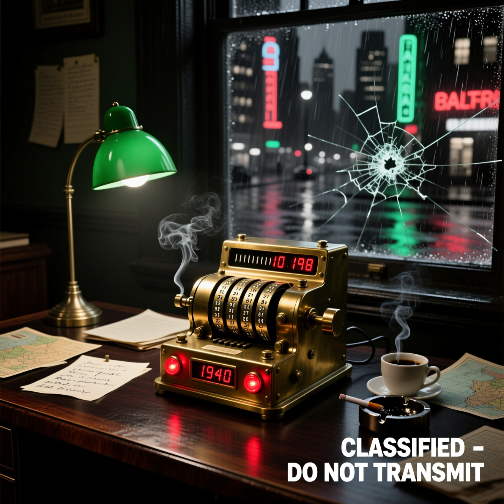

# 🕵️ Челлендж 3: «Шпионский шифратор»

Работаем в файле classified_transmit.py

###  Напиши программу-анкету, где компьютер проверяет ответы.

Создай программу, которая превратит любое сообщение в секретный код.

```
Подсказки:

.upper() — делает все буквы заглавными

[::-1] — переворачивает текст задом наперед

Можно применить оба метода сразу: текст.upper()[::-1]

Пример: "привет" → "ТЕВИРП"
```

# 💡 Общие советы:
Пиши по частям - сделал один вопрос → запусти → проверь

Тестируй разные ответы - что будет если ввести число? Текст? Ничего?

Не бойся ошибок - они показывают, где нужно подумать

Не бойся ошибок — они помогают учиться!<br><br>
<a href="https://gifyu.com/image/bTf84"></a>


Как выполнишь задание — покажи мне результат! У тебя всё получится! 🚀

# Команды после того как ты выполнишь задание

В консоль нужно написать:

1. git add . — как собрать вещи в чемодан перед поездкой 🧳
2. git commit — как закрыть чемодан и написать на нем стикер "Летние вещи" 🏷️
3. git push — как отправить чемодан в путешествие (на GitHub) ✈️
